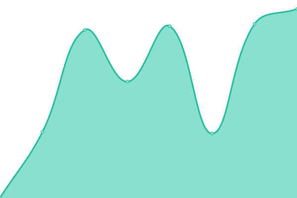
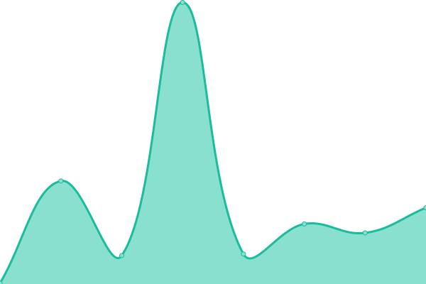
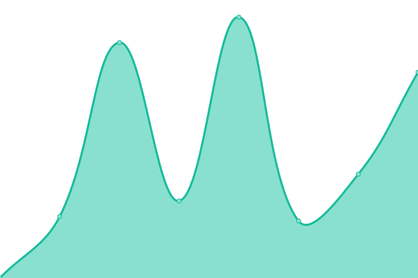

# [📈 Live Status](https://status.unfur.ly): <!--live status--> **🟩 All systems operational**

This repository contains the open-source uptime monitor and status page for [unfurlyco](https://status.unfur.ly), powered by [Upptime](https://github.com/upptime/upptime).

With [Upptime](https://upptime.js.org), you can get your own unlimited and free uptime monitor and status page, powered entirely by a GitHub repository. We use [Issues](https://github.com/unfurlyco/uptime/issues) as incident reports, [Actions](https://github.com/unfurlyco/uptime/actions) as uptime monitors, and [Pages](https://status.unfur.ly) for the status page.

<!--start: status pages-->
<!-- This summary is generated by Upptime (https://github.com/upptime/upptime) -->
<!-- Do not edit this manually, your changes will be overwritten -->
<!-- prettier-ignore -->
| URL | Status | History | Response Time | Uptime |
| --- | ------ | ------- | ------------- | ------ |
|  [Unfur.ly Landing Page](https://unfur.ly/app/version) | 🟩 Up | [unfur-ly-landing-page.yml](https://github.com/unfurlyco/uptime/commits/HEAD/history/unfur-ly-landing-page.yml) | 

 606ms
     
 | 

<a href="https://status.unfur.ly/history/unfur-ly-landing-page">100.00%</a>
    

|  [Unfur.ly App Login](https://unfur.ly/app/login) | 🟩 Up | [unfur-ly-app-login.yml](https://github.com/unfurlyco/uptime/commits/HEAD/history/unfur-ly-app-login.yml) | 

 306ms
     
 | 

<a href="https://status.unfur.ly/history/unfur-ly-app-login">100.00%</a>
    

|  [Unfur.ly API](https://unfur.ly/api/ui/info) | 🟩 Up | [unfur-ly-api.yml](https://github.com/unfurlyco/uptime/commits/HEAD/history/unfur-ly-api.yml) | 

 262ms
     
 | 

<a href="https://status.unfur.ly/history/unfur-ly-api">100.00%</a>
    

|  [Unfur.ly Redirector](https://unfur.ly/version) | 🟩 Up | [unfur-ly-redirector.yml](https://github.com/unfurlyco/uptime/commits/HEAD/history/unfur-ly-redirector.yml) | 

 136ms
     
 | 

<a href="https://status.unfur.ly/history/unfur-ly-redirector">100.00%</a>
    

|  [Unfur.ly Free/Demo Tier Test](https://unfur.ly/freetier) | 🟩 Up | [unfur-ly-free-demo-tier-test.yml](https://github.com/unfurlyco/uptime/commits/HEAD/history/unfur-ly-free-demo-tier-test.yml) | 

 2287ms
     
 | 

<a href="https://status.unfur.ly/history/unfur-ly-free-demo-tier-test">99.70%</a>
    

|  [Unfur.ly Paid Tier Test](https://unfur.ly/12345) | 🟩 Up | [unfur-ly-paid-tier-test.yml](https://github.com/unfurlyco/uptime/commits/HEAD/history/unfur-ly-paid-tier-test.yml) | 

 549ms
     
 | 

<a href="https://status.unfur.ly/history/unfur-ly-paid-tier-test">100.00%</a>
    

|  [Unfur.ly GeoFurl Test](https://unfur.ly/BeastGames) | 🟩 Up | [unfur-ly-geo-furl-test.yml](https://github.com/unfurlyco/uptime/commits/HEAD/history/unfur-ly-geo-furl-test.yml) | 

 729ms
     
 | 

<a href="https://status.unfur.ly/history/unfur-ly-geo-furl-test">100.00%</a>
    

<!--end: status pages-->

[**Visit our status website →**](https://status.unfur.ly)

## 📄 License

- Powered by: [Upptime](https://github.com/upptime/upptime)
- Code: [MIT](./LICENSE) © [Anand Chowdhary](https://anandchowdhary.com), supported by [Pabio](https://pabio.com)
- Data in the `./history` directory: [Open Database License](https://opendatacommons.org/licenses/odbl/1-0/)
